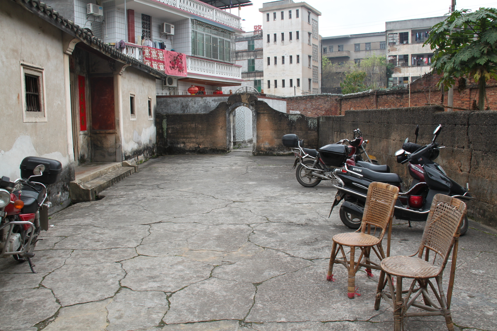
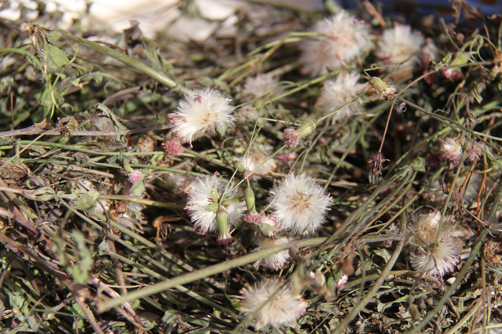
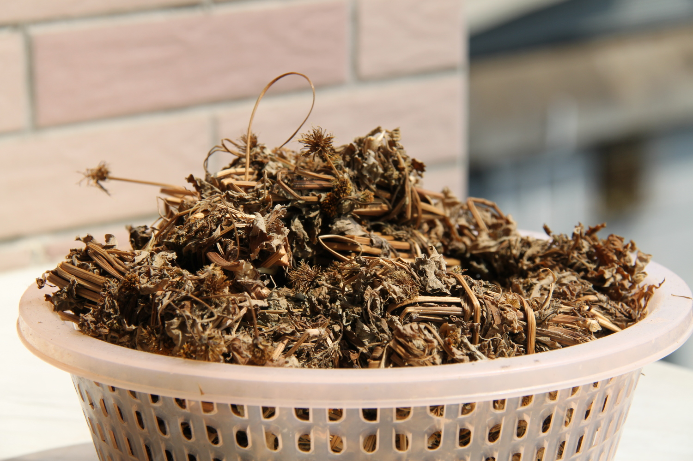
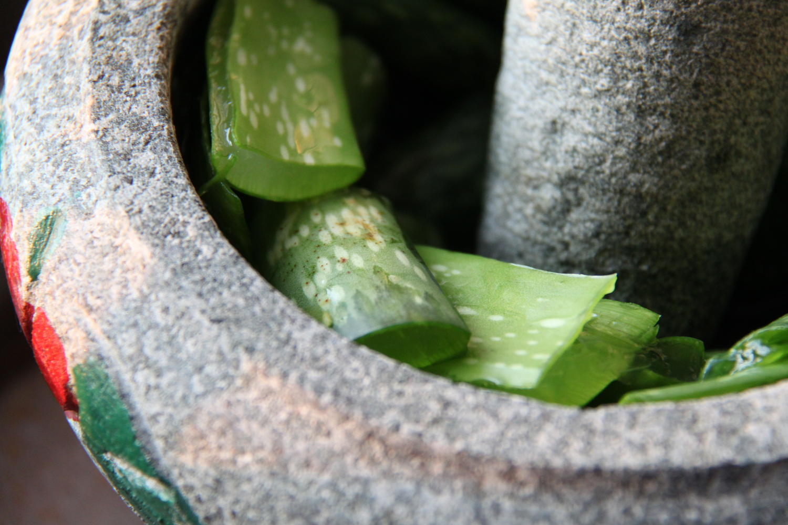
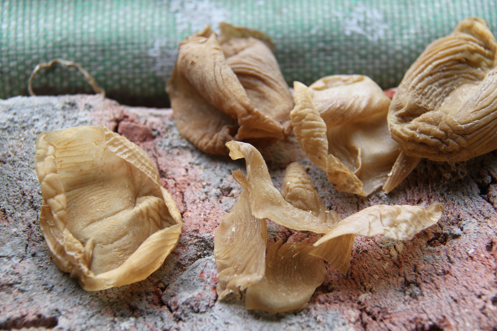
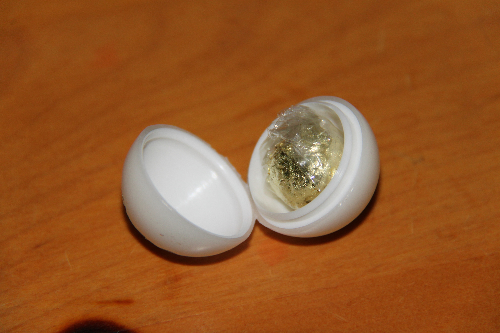
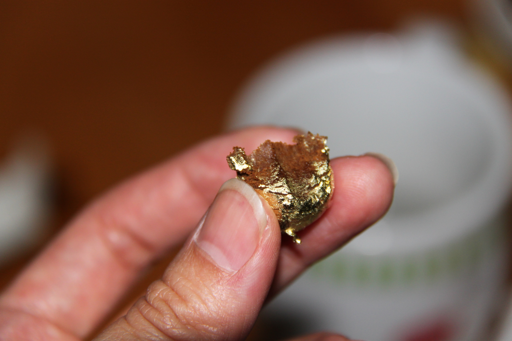
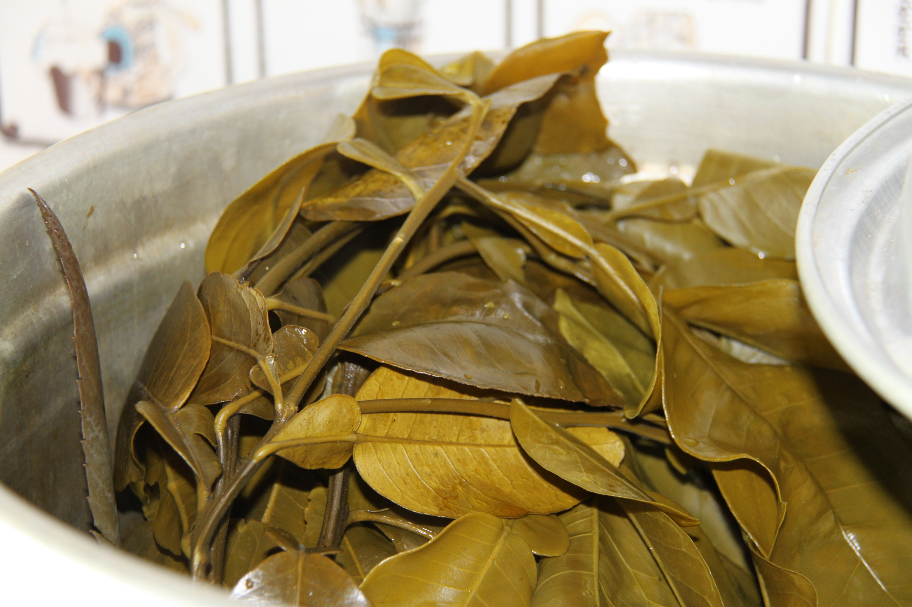

<h2>Health</h2>

<section class="example-image">
  
In Moiyan I saw an interesting combination of Chinese and Western healthcare.

</section>

<section class="example-image">
  
I visited the surgery of a traditional Chinese doctor, whose waiting room looked like this:

  
</section>

<section class="example-image">
  
He would write a prescription for Chinese herbs, which you then took to the Chinese herbal pharmacist (no photo, sorry).

</section>

<section class="example-image">
  
Some people collect herbs to prepare themselves at home:

  
  
</section>

<section class="example-image">
  
Fresh aloe vera being prepared as a treatment for injured skin:

  
</section>

<section class="example-image">
  
I was introduced to these dried gizzard membranes 雞內金 : 鸡内金 Jī nèi jīn : gê(1) nui(4) gim(1), which are apparently given to children to help the spleen and kidney:

  
</section>

<section class="example-image">
  
After all the 熱 : 热 rè : ngiad(6) fried food that I had eaten, it was time for some 'cooling' medicine! My cousin had this commercial medication at home, wrapped in plastic and sealed in a wax ball:

  
  
The chewy centre tasted very much like that bitter, green Chinese powder my mum used to force on me for mouth ulcers.

  
</section>

<section class="example-image">
  
One of the bigger modern hospitals in town:

  
</section>

<section class="example-image">
  
After staying in hospital, people like to wash with water extracted from boiled pomelo and loquat leaves (at least I think the second type was loquat!):

  
</section>
